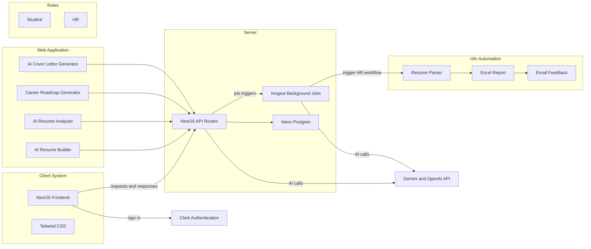

# 🧑‍💻 AI Career Coach Platform

An AI-powered Smart Education platform that helps students build professional resumes, analyze their skills, generate personalized career roadmaps, and prepare for job opportunities — while providing HR teams with smart automation for resume evaluation.

> Theme: Student Innovation → Smart Education  
> Category: Software, AI, Career-Tech

---

## 🚀 Problem Statement

In today’s digital age, students face major challenges in:
- Creating professional resumes tailored to job roles
- Identifying missing skills compared to industry requirements
- Finding structured learning paths to close skill gaps
- Preparing effective cover letters for applications

At the same time, HR recruiters struggle to evaluate large volumes of resumes efficiently.

---

## 💡 Our Solution

The AI Career Coach Platform is a one-stop solution that leverages AI + Smart Automation to solve these challenges for both students and HRs.

- Effective Learning → Career roadmap with skill-based learning resources
- Efficient Preparation → AI tools for resumes & cover letters save time
- Flexible & Personalized → Guidance tailored to each student’s profile
- Comfortable Access → Unified dashboard with all tools in one place

---

## 🔑 Core Features

### For Students
- AI Resume Builder — Generate professional, ATS-friendly resumes from simple inputs
- AI Resume Analyzer — Compare resumes against job descriptions and highlight missing keywords
- Career Roadmap Generator — Personalized learning paths with curated YouTube/video resources to close skill gaps
- AI Cover Letter Generator — Auto-create tailored cover letters for job applications

### For HRs
- Smart Automation (via n8n)
  - Auto-process resumes received via email
  - Extract candidate details and skills
  - Generate Excel/CSV reports with ratings (0–10)
  - Send feedback emails to candidates (selected/rejected with reasoning)

---

## 🛠️ Tech Stack

- Frontend
  - React.js / Next.js → Interactive dashboard
  - TailwindCSS / Material UI → Modern UI components

- Backend
  - Node.js + Express.js → APIs & business logic
  - MongoDB / PostgreSQL → Storing resumes, job roles, user data

- AI / NLP
  - OpenAI / HuggingFace APIs → Resume analysis, cover letter & roadmap generation
  - Custom ML Models → Keyword extraction & skill matching

- Automation
  - n8n → Resume parsing, email workflows, Excel report generation

---

## 📊 System Architecture

---

## 🖥️ Dashboard UI (Planned)

- Student Dashboard
  - Resume Builder
  - Resume Analyzer
  - Career Roadmap
  - Cover Letter Generator

- HR Dashboard
  - Upload/Review candidates
  - Access reports & analytics
  - Download CSV/Excel summaries

---

## 📡 API Overview (Draft)

Base URL: `http://localhost:5000/api`

- POST `/resume/build`
  - Input: user profile data (education, experience, skills)
  - Output: ATS-friendly resume (JSON + downloadable PDF)

- POST `/resume/analyze`
  - Input: resume file or JSON + job description text
  - Output: match score, missing keywords, improvement suggestions

- POST `/career/roadmap`
  - Input: skills profile and target role
  - Output: step-by-step learning plan + curated video/resource links

- POST `/cover-letter/generate`
  - Input: resume highlights + job description
  - Output: tailored cover letter (markdown/text)

- POST `/hr/upload` (or webhook)
  - Input: resume files (multipart) or parsed data from n8n
  - Output: normalized candidate profile + rating

- GET `/hr/report`
  - Output: CSV/Excel report of candidates with ratings (0–10)

> Note: Endpoints are subject to change as the project evolves.

---

## ⚡ Automation with n8n

Suggested workflow:
1. Email Trigger
   - Watch HR inbox via IMAP/POP3 for new emails with resume attachments
2. Attachment Processing
   - Extract resume files (PDF/DOCX)
3. Parsing & Analysis
   - Use a Resume Parser (n8n node or custom function)
   - Call backend `/hr/upload` or `/resume/analyze` for scoring
4. Report Generation
   - Aggregate results into Google Sheets / Excel
   - Export CSV/Excel
5. Candidate Feedback
   - Send templated emails to candidates (selected/rejected with reasoning)
6. HR Notifications
   - Send Slack/Email summary with daily report link

Security tips:
- Use a shared secret (`N8N_WEBHOOK_SECRET`) for backend webhooks
- Sanitize attachments and limit file types/sizes
- Log audit trails for compliance

---

## 🌟 Future Scope

- Direct job applications (LinkedIn / Naukri API integration)
- Gamified career roadmap (badges, milestones)
- Multi-language resume & cover letter generation
- Analytics dashboard for colleges/placement cells
- Role-specific resume templates and benchmarking
- Team review workflows for HRs

---

## 🤝 Contributing

Contributions are welcome!
- Fork the repo and create a feature branch
- Write clear commit messages
- Add tests where applicable
- Open a Pull Request with a descriptive overview

---

## 📄 License

MIT License — feel free to use and improve!

---

## 📫 Contact

For questions, suggestions, or collaborations:
- Open an issue or discussion in this repository
- Or reach out via email (add your contact here)

---
